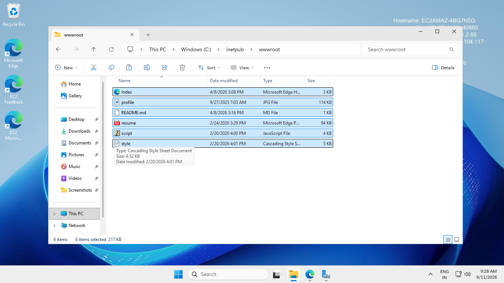

# AWS-PROJECT-1-EC2-
This is the project in which I deployed my portfolio in web server of IIS
# AWS EC2 IIS Web Server Project

## Objective
Deploy a website on AWS EC2 Windows Server using IIS.

## Services Used
- AWS EC2
- Security Groups
- Windows Server
- IIS Web Server

## Steps Performed
1. Created EC2 instance.
2. Configured Security Group.
3. Installed IIS.
4. Hosted sample webpage.
5. Tested website using Public IP.

## Screenshots

### EC2 Instance

### IIS Home Page

### wwwroot 

### Website Output

## Learning Outcomes
- AWS EC2 management
- Security Group configuration
- IIS deployment
- Basic cloud hosting
